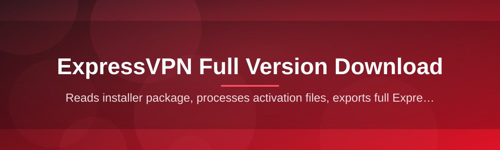

# expressvpn-full-suite-manager 🛡️🔐

  

*One tidy control panel to fetch, verify, and manage your ExpressVPN full version download — no scavenger hunt required.*

## 📖 Overview

Picture this: you just want a clean, reliable ExpressVPN full version download, but instead you end up with fourteen browser tabs, three sketchy mirror sites, and a download manager that's more confused than you are. That was the actual origin story of this project — a weekend rabbit hole trying to find a *single trustworthy place* to grab the full suite, verify it wasn't tampered with, and get it running without babysitting five different installers. So we built the tool we wished existed.

**expressvpn-full-suite-manager** is a lightweight Windows companion app that centralizes the entire lifecycle of getting ExpressVPN's full desktop suite onto your machine — from locating the correct build for your system, to checksum verification, to a guided first-run setup. It doesn't reinvent VPN tech; it removes the friction *around* it. Think of it less as a VPN client and more as the concierge that walks you to the front door of the actual application.

This project is for everyday users who just want their ExpressVPN full version download to be fast and drama-free, for IT folks provisioning multiple machines, and for anyone tired of guessing whether a download link is legitimate. If you've ever bookmarked a download page "just in case," this tool is built to make that bookmark unnecessary.

  

---

## 🚀 What Used to Suck (and What We Fixed)

> [!NOTE]
> Every capability below maps directly to a real annoyance someone on our team hit while trying to manage an ExpressVPN full version download across multiple PCs.

1. **The "Which Link Is Real?" Problem** — Search results for any VPN download are a minefield of copycat pages. This manager points to one consistent, versioned landing page so you stop guessing and start downloading.

2. **Silent Corrupted Installers** — Downloads that fail halfway often *look* complete but aren't. Built-in checksum verification flags mismatched files before you ever double-click the installer.

3. **Version Confusion** — "Is this the latest build or something from two years ago?" The suite manager displays version metadata up front so you're never installing something stale.

4. **Multi-Machine Fatigue** — Setting up ExpressVPN on five office laptops manually is tedious. Batch-friendly configuration profiles let you replicate a working setup across machines in minutes.

5. **Zero Visibility Into Setup Steps** — Traditional installers are black boxes. This tool shows a readable, step-by-step log of exactly what's happening during setup.

6. **No Rollback Option** — Bad installs used to mean a full uninstall-reinstall cycle. A lightweight snapshot lets you revert to your prior configuration state.

7. **Cluttered Post-Install Experience** — Extra toolbars, shortcuts you didn't ask for — gone. The manager keeps your desktop exactly as clean as it was before.

8. **Guesswork Around System Compatibility** — A pre-flight compatibility check tells you immediately if your Windows build supports the full suite, instead of failing midway.

---

## 🧭 Getting Started (Without the Headache)

1. Visit the landing page using the download button above.

2. Grab the latest build — it's a single standalone package, no companion files required.

3. Run the executable and let the guided setup walk you through configuration.

4. Launch the manager dashboard and confirm your ExpressVPN full version download completed and verified successfully.

> [!TIP]
> First-time users should let the pre-flight compatibility check run fully before proceeding — it catches 90% of setup issues before they happen.

---

## 💻 System Requirements

| Requirement | Details |
|---|---|
| OS | Windows 10 (64-bit) or Windows 11 |
| Disk Space | 250 MB free minimum |
| RAM | 2 GB or more recommended |
| Dependencies | None — fully standalone |
| Admin Rights | Required for first-run setup only |

> [!IMPORTANT]
> This tool is standalone by design. You do not need to pre-install any runtime, framework, or package manager for it to function.

---

## ⚙️ How It Works

The architecture is intentionally simple — four moving parts, one clear path from click to completion.

1. **Request** — You trigger a download request from the dashboard.

2. **Resolve** — The manager resolves the correct build for your OS version.

3. **Verify** — A checksum pass confirms file integrity.

4. **Deploy** — The guided installer takes over and finishes setup.

5. **Confirm** — A final status check reports success back to the dashboard.

---

## 🩹 Troubleshooting

<strong>My download keeps stalling partway through — what gives?</strong>

This is almost always a network interruption. Re-run the download; the manager resumes from the last verified checkpoint instead of starting over.

<strong>The checksum verification failed. Should I be worried?</strong>

Not worried, just cautious. Delete the partial file and re-download — a failed checksum simply means the file didn't arrive intact, not that anything is broken on your end.

<strong>Setup says my Windows build is unsupported. Now what?</strong>

Run Windows Update first. Most "unsupported build" flags resolve once you're on a current cumulative update.

<strong>Can I use this on a machine without internet during setup?</strong>

No — the initial full version download requires an active connection. Once installed, offline usage depends on ExpressVPN's own app behavior.

<strong>Why does the app ask for admin rights only once?</strong>

Elevated permissions are needed to register system-level components during first-run setup. After that, day-to-day use runs at standard privilege.

> [!WARNING]
> Avoid pausing your antivirus during download "to speed things up." It doesn't help, and it defeats the purpose of the integrity checks this tool performs.

---

## 🎨 UI, UX & Customization

The dashboard is built to feel calm, not clinical. A few details worth knowing:

- **Themes** — Light, Dark, and an auto mode that follows your Windows theme setting.

- **Keyboard shortcuts:**

| Shortcut | Action |
|---|---|
| `Ctrl + D` | Start a new download |
| `Ctrl + R` | Re-run verification |
| `Ctrl + L` | Open activity log |
| `Ctrl + ,` | Open settings |

- **Settings panel** — Toggle auto-checksum, notification sounds, and default install directory.

- **Status colors** — Green for verified, amber for in-progress, red for failed integrity checks — no ambiguous icons to decode.

  

---

## 🤝 Contributing & Community

This project grew out of a shared annoyance, and it keeps improving the same way — through people reporting what still bugs them.

1. Open an issue describing what's broken or missing.

2. Fork the repo and submit a pull request with a clear description.

3. Keep changes focused — small, reviewable PRs move faster than sprawling ones.

> [!TIP]
> Discussions are the best place to propose bigger ideas before writing code. It saves everyone rework.

We welcome documentation fixes, UI polish, and translation contributions just as much as code.

---

## 📜 License

Released under the [MIT License](LICENSE), 2026.

---

## ⚠️ Disclaimer

This project is an independent community tool for managing and streamlining your ExpressVPN full version download experience. It is not affiliated with, endorsed by, or officially connected to ExpressVPN or its parent company. All trademarks belong to their respective owners. Use this tool responsibly and always download software from sources you trust.

  

